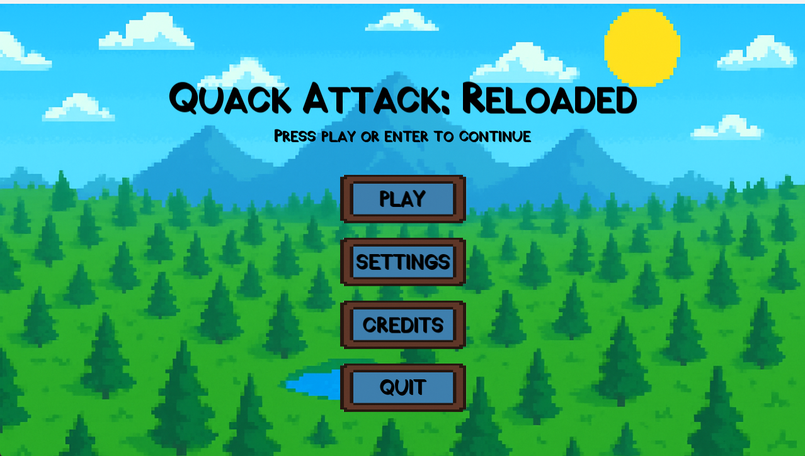
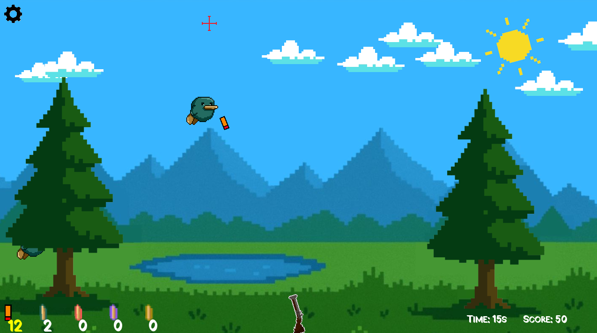

# **Quack Attack: Reloaded**

A **modern remaster** inspired by the classic *Duck Hunt* on the NES, reimagined with new mechanics, improved visuals, and a focus on smooth, engaging gameplay.  
The goal is to capture the retro essence of the original while introducing dynamic systems and fresh challenges.

---

## 🚀 Tech Stack

- **Language:** C++  
- **Graphics Framework:** [SFML](https://www.sfml-dev.org/)  
- **Architecture:** modular, scalable, and maintainable (design patterns applied: Factory, Object Pooling, Gameloop, Facade and others.  
- **Development Tools:** Visual Studio  

---

## 🎮 Features

- Classic *Duck Hunt* gameplay reimagined with modern mechanics  
- Smooth and responsive controls  
- Dynamic difficulty scaling for replayability  
- Modular architecture for easy expansion and maintenance  
- Retro-inspired visuals with modern polish  

---

## 📸 Screenshots

  
*Pantalla principal del juego*

  
*Acción en pleno gameplay*

---

## 📂 Installation & Execution

1. Clonar el repositorio:  
   ```bash
   git clone https://github.com/MartinSolerGDev/CMM_Soler.git
2. Abrir en Visual Studio
3. Compilar el proyecto y disfrutar del juego

## 🙌 Acknowledgements
Este proyecto no hubiera sido posible sin el apoyo y la guía de:
- Image Campus: por brindar el espacio y la formación que hicieron crecer este proyecto.
- Prof. Federico Olive.
- Prof. Franco Fioretti.
- Prof. Nicolas Mironoff.

## ITCH.IO 
-[Link to itch.io](https://msoler.itch.io/quack-attack-reloaded)
